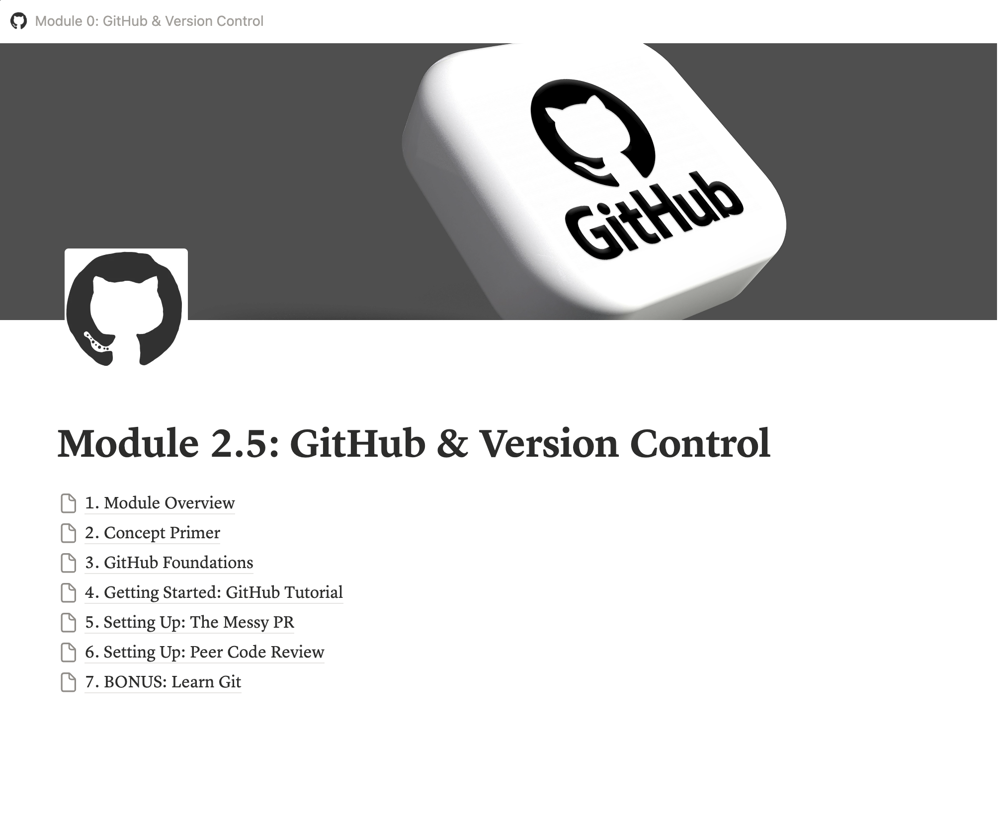
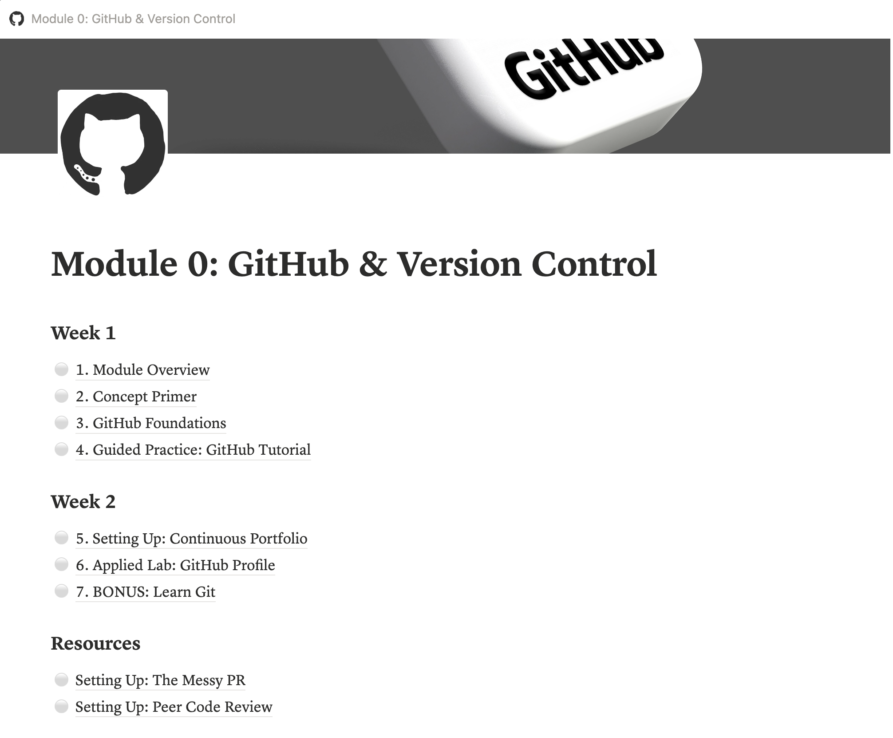

# Impact Project: Module 0: GitHub & Version Control

*Create a module that deepens the TLA program curriculum for future cohorts.*

**Target Skills: Stakeholder Identification, Problem Solving, Resource Creation, Concise Summarization, Verbal Precision, Accessible Communication**

## Task

I saw a bottleneck in this Technical Leadership Accelerator (TLA) cohort where some of my peers with less experience using GitHub ended up spending more time figuring out the technical setup for GitHub than on the "Messy PR" or "Peer Code Review" projects of the program. I recognized that TLA fellows come from all different backgrounds and experiences in computer science, with some who feel very comfortable using GitHub, while others do not, and yet many of the projects heavily rely on assumed knowledge and comfort with the platform. As the inaugural cohort of the TLA program, we directly shape future iterations of the program and the experiences of future cohorts, which makes this issue even more crucial to address as the ones who experienced it firsthand. Instead of simply calling out this oversight, I set out to build a module as my Impact Project that enables future TLA fellows to familiarize themselves with GitHub and its importance in technical communication and collaboration.

## Process

Since my stakeholders are fellows in this program, I talked to my peers about their thoughts on the lack of GitHub resources and information throughout the projects we have completed. Many fellows mentioned how they are inexperienced with GitHub, or have used the platform briefly but never had to utilize the pull request interface, which was necessary to conduct our PR review. They also explained that they would have benefitted a lot more from tutorial videos rather than written instructions on skills like how to create a repository and a new branch, or leave inline comments on a pull request. This feedback informed my initial draft of the module's structure:

I made designated placeholders for tutorial videos I planned to record about how to complete the setups on GitHub for both PR-focused projects from the corresponding module in our TLA program. I also thought about how I would introduce GitHub, and before that, the concept of version control, so I added additional pages that loosely followed the structure of other TLA projects my cohort and I had completed.

I continued to build the module on Notion, taking advantage of all of its integrations, features, and block elements to embed external sites and resources, as well as the videos I recorded. As I kept building, I made an effort to ensure the module closely resembled our TLA platform, using the same formatting, color palettes, and page flow whenever possible. 

In the middle of building, I realized that setting up our TLA portfolio itself from the very first project of the program also required prior knowledge of GitHub. The provided Markdown template for the portfolio was hosted on Notion, and I remembered the tedious process of manually exporting each Notion page to a Markdown file, unzipping and renaming the files, and uploading each properly to a new repository. 

Thus, I decided to create a template repository on GitHub using the Markdown template, and an additional setup resource for this module that described how to use it. I decided to switch the project, or "Applied Lab" in this module, from making a portfolio website hosted on GitHub Pages to personalizing one's GitHub profile to narrow down the scope of the module and maintain its cohesiveness.

At this point, I also organized all the pages into categories, creating the final module structure:

## Deliverable

[Link to Project](https://vrielle.notion.site/Module-0-GitHub-Version-Control-3a5f5cb6e15e80aaa0cfd0193da7c33e)

I created a module in Notion that teaches the basics of GitHub and version control to utilize for future iterations and cohorts of this Technical Leadership Accelerator (TLA) Program. I created the module in Notion for easy access and eventual implementation, since the current TLA platform integrates nicely with Notion. The module closely follows the structure of existing TLA modules and includes:

1. Module Overview, which details the overall arc of the lessons, activities, and learning goals for fellows.
2. Concept Primer, which includes relevant readings and articles on the topic – in this case, version control.
3. GitHub Foundations, a compiled resource of articles covering the basics of GitHub and its significance in the tech industry.
4. Guided Practice, which instructs on how to set up a GitHub account and practice the complete GitHub pull request workflow.
5. Applied Lab, which walks through creating a GitHub profile that can showcase the TLA portfolio and other projects.
4. Additional Resources, such as video tutorials on the GitHub setup process for other projects in the TLA program, and an interactive game teaching Git. 

The idea is that the Notion link to the module can be pasted into the TLA platform, which will automatically create, format, and publish the module.

## Reflection

I received unanimous positive feedback from my TLA fellows, who all elaborated on how well thought out and organized the module was, as well as how they wished they had it while going through the program. They acknowledged the constraints and reasoning behind using Notion to host the project, but also mentioned how they would want to see the module on our TLA platform, with specific tutorial videos also linked to the corresponding TLA module they aid. From this development process, I learned that the biggest parts of leading are self-driven and shaped by others, and both are equally important and valuable. 
