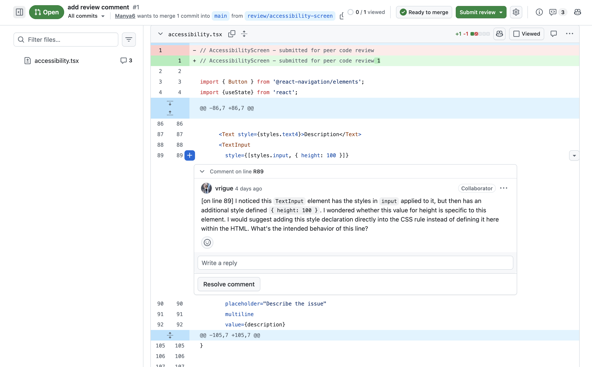
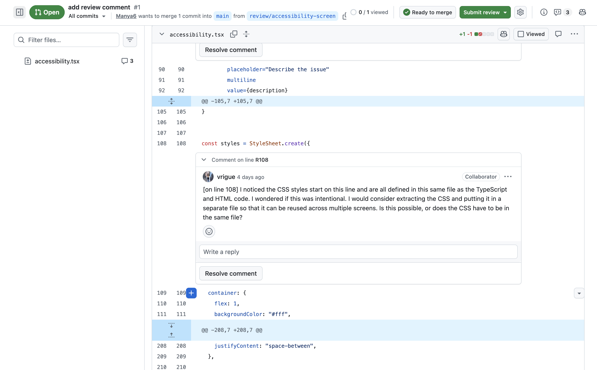
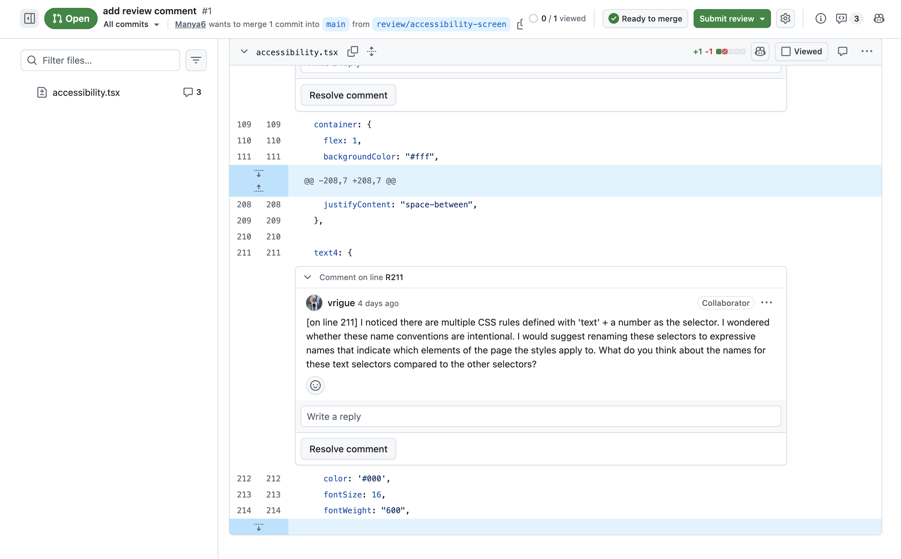

# Peer Code Review

*Formally review code submitted by a peer.*

**Target Skills: Code Review, Feedback Delivery**

## Task

> Submit one piece of your own code that lives in GitHub. Then, propose new code as a GitHub pull request (PR) and send your partner – another fellow in this Technical Leadership Accelerator cohort – the GitHub PR link. Your partner will leave a formal written review. You'll do the same for their code.

## Process

I practiced the complete GitHub pull request workflow: creating a new repository, making a new branch and pushing code to it, and opening a pull request to merge my branch into `main`. I used code from an old assignment as a part of my Data Structures and Algorithms course. I sent my partner the PR link for them to leave their formal written review. Then, I practiced using GitHub's PR interface, and conducted my own formal review of my partner's code using the PR link I received from them. My review comprised of inline comments left directly on specific lines of code, and a summary addressing what's working well, what I would prioritize, and what I'd like to know more about in their code. 

I structured my comments around the Noticed / Wondered / Would-Try (N/W/WT) framework, which is adapted from Annie Fetter's Notice and Wonder practice that is widely used by the National Council of Teacher of Mathematics.  The Noticed and Wondered components focus on naming what you _notice_ (observations without judgement) and what you _wonder_ about the code to prevent the author from becoming defensive or jumping to conclusions. The Would-Try piece focuses on proposing a concrete path forward that is a suggestion to the author rather than a enforced command, preserving their ownership over their code. This framework is also very similar to software engineer Philip Hauer's OIR Rule (Observation, Impact, Request), whose work is one of the most cited practitioner references on the human dynamics of code review.

## Deliverable

[Link to GitHub PR](https://github.com/Manya6/accessibilty-screen/pull/1)

## Reflection

_**What was the hardest feedback to write? What would you change if you did it again?**_

The hardest feedback to write was the comments I left on updating CSS selectors to have more expressive names. It was difficult to write these comments since I wanted to articulate my thoughts constructively without coming off as too nitpicky. If I were to provide feedback again, I would change my approach by taking additional time to understand the code as well as the codebase it's from before leaving any comments.